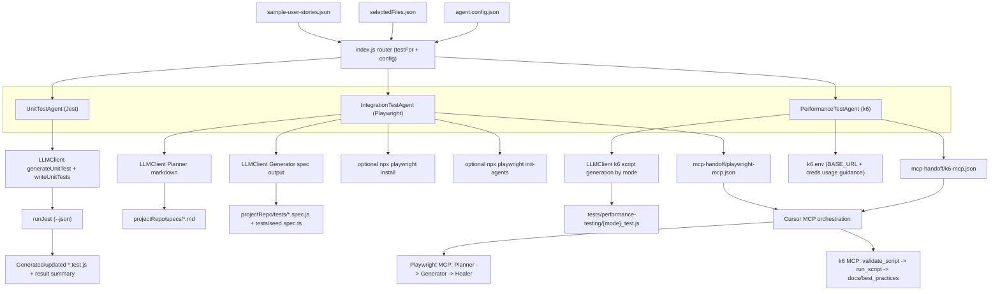

```mermaid
flowchart TB
    userStories["sample-user-stories.json"] --> router["index.js router (testFor + config)"]
    selectedFiles["selectedFiles.json"] --> router
    agentConfig["agent.config.json"] --> router

    router --> unitAgent["UnitTestAgent (Jest)"]
    router --> integrationAgent["IntegrationTestAgent (Playwright)"]
    router --> performanceAgent["PerformanceTestAgent (k6)"]

    subgraph agentsCol[" "]
        direction TB
        unitAgent
        integrationAgent
        performanceAgent
    end

    unitAgent --> unitGen["LLMClient generateUnitTest + writeUnitTests"]
    unitGen --> jestRun["runJest (--json)"]
    jestRun --> unitOutputs["Generated/updated *.test.js + result summary"]

    integrationAgent --> plannerGen["LLMClient Planner markdown"]
    plannerGen --> specsOut["projectRepo/specs/*.md"]
    integrationAgent --> generatorGen["LLMClient Generator spec output"]
    generatorGen --> pwTestsOut["projectRepo/tests/*.spec.js + tests/seed.spec.ts"]
    integrationAgent --> pwInstall["optional npx playwright install"]
    integrationAgent --> initAgents["optional npx playwright init-agents"]
    integrationAgent --> mcpHandoffPw["mcp-handoff/playwright-mcp.json"]

    performanceAgent --> k6Gen["LLMClient k6 script generation by mode"]
    k6Gen --> k6Scripts["tests/performance-testing/{mode}_test.js"]
    performanceAgent --> k6Env["k6.env (BASE_URL + creds usage guidance)"]
    performanceAgent --> mcpHandoffK6["mcp-handoff/k6-mcp.json"]

    mcpHandoffPw --> cursorMcp["Cursor MCP orchestration"]
    mcpHandoffK6 --> cursorMcp
    cursorMcp --> pwMcp["Playwright MCP: Planner -> Generator -> Healer"]
    cursorMcp --> k6Mcp["k6 MCP: validate_script -> run_script -> docs/best_practices"]
```