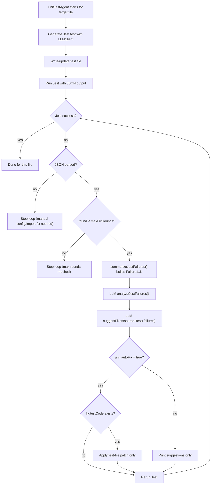

```mermaid
flowchart TB
    start["UnitTestAgent starts for target file"] --> generate["Generate Jest test with LLMClient"]
    generate --> write["Write/update test file"]
    write --> runJest["Run Jest with JSON output"]
    runJest --> passCheck{"Jest success?"}

    passCheck -->|yes| done["Done for this file"]
    passCheck -->|no| hasJson{"JSON parsed?"}

    hasJson -->|no| stopNoJson["Stop loop (manual config/import fix needed)"]
    hasJson -->|yes| roundCheck{"round < maxFixRounds?"}

    roundCheck -->|no| stopMax["Stop loop (max rounds reached)"]
    roundCheck -->|yes| summarize["summarizeJestFailures() builds Failure1..N"]
    summarize --> analyze["LLM analyzeJestFailures()"]
    analyze --> suggest["LLM suggestFixes(source+test+failures)"]

    suggest --> autoFixFlag{"unit.autoFix = true?"}
    autoFixFlag -->|no| printOnly["Print suggestions only"]
    autoFixFlag -->|yes| hasTestCode{"fix.testCode exists?"}

    hasTestCode -->|no| rerun["Rerun Jest unchanged"]
    hasTestCode -->|yes| patch["Apply test-file patch only"]
    patch --> rerun["Rerun Jest"]

    printOnly --> rerun
    rerun --> passCheck
```